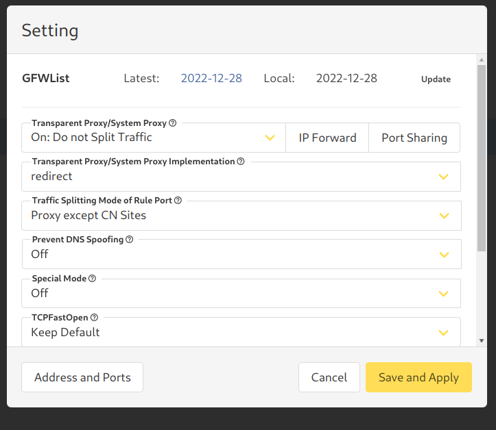

## Installation of V2ray-core

```bash
sudo dnf copr enable zhullyb/v2rayA
sudo dnf install v2ray-core
```

## Installation of  V2rayA

```bash
sudo dnf install v2raya
```

## Starting services

```bash
sudo systemctl enable v2ray
sudo systemctl enable v2raya
sudo service v2ray start
sudo service v2raya start
```

Go to [v2rayA panel](http://127.0.0.1:2017)
Setting -> update GFWList

